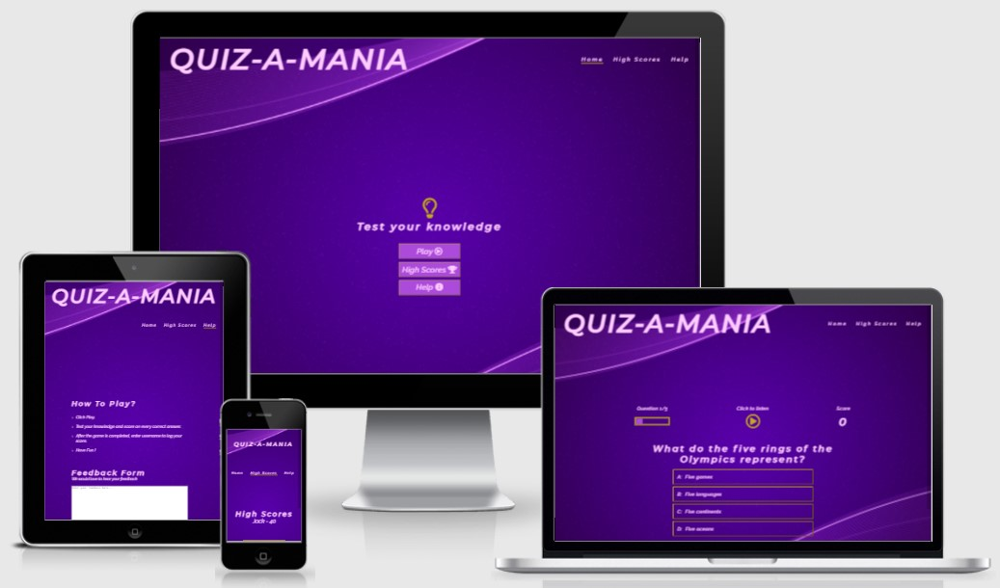

# Quiz-a-mania

## Code Institute: Milestone Project 2

### HTML/CSS/Javascript Essentials: Interactive front-end website

[Click here to view the live project.](https://pratimagurav.github.io/quiz-a-mania/)

[Click here to view the repository.](https://github.com/PratimaGurav/quiz-a-mania)

## Table of Contents:
- [User Experience (UX)](https://github.com/PratimaGurav/quiz-a-mania#user-experience-ux)  

- [Features](https://github.com/PratimaGurav/quiz-a-mania#features)

- [Technologies Used](https://github.com/PratimaGurav/quiz-a-mania#technologies-used)
  
- [Testing](https://github.com/PratimaGurav/quiz-a-mania#testing)

- [Deployment](https://github.com/PratimaGurav/quiz-a-mania#deployment)

- [Credits](https://github.com/PratimaGurav/quiz-a-mania#credits)

- [Acknowledgements](https://github.com/PratimaGurav/quiz-a-mania#acknowledgements)
    

## User Experience (UX)

-   ### Site Goals
     Quiz-a-mania is an interactive website which enables users to play quiz by answering a fixed set of questions. The quiz is set to test General Knowledge of users with multiple choice questions. It includes a feature by which users can opt to listen to the questions and the respective options. Further users get prompted if their answer is correct or incorrect by color formatting and audio. Users score for every correct answer with an option to submit their score and rank themselevs on the high scores by providing their username.

-   ### Target Audience    
      The site is targetted to everyone who loves to play online quiz with an aim to score high. 
      People of all ages from different background can play this fun and interactive quiz.
   

-   ### User stories

    -   #### First Time Visitor
    1. I would like to play a fun quiz that would test my knowledge.
    2. I would like to know how I rank on the High Scores.
    3. I want a quiz that is easy to play.
       

    -   #### Returning Visitor
    1. I would like to play a fun quiz that would test my knowledge with few new set of questions.
    2. I would like to access the application easily.
    3. I would like to know the High scores quickly.
         

    -   #### Frequent User 
    1. I would like to have sufficient questions to kep me interested.
    2. I would like to increase my knowledge while playing the quiz.
    3. I would like to give feedback if needed. 
        

-   ### Design
    -   #### Colour Scheme
        The main colours used are Very Light Purple, Cookie Brown, Purple Flower, Daisy Bush,
        Medium Green, Jasper. These colours complement eachother and maintain good contrast levels.
          
    
    -   #### Typography 
        Raleway italic font is the main font used throughout the whole website with Sans Serif as the fallback font in case for any reason the font isn't being imported into the site correctly. Montserrat italic is used for headings with Sans Serif as the fallback.    
        

    -   #### Imagery
        Background image is used to strike and catch users' attentions. The background has been kept consistent throughout the site for enahnced user experience.
         

*   ### Wireframes

    -   Balsamiq Wireframes - [Wireframes](assets/documents/Quiz-a-mania.pdf)

## Features

 ### Existing Features

   - __The Scope__ 

      The scope of Quiz-a-mania has been created with the following features :
      - Interactive Quiz Application.
      - Audio button to read out the current question and its options.
      - Intantly display if the answer is correct or incorrect along with supporting audio.
      - Ability to submit scores to High-Scores.
      - Fully responsive design.
      - Easy navigation bar which is consistent and completely responsive.
      - Help page with instructions on how to play.
      - Simplified feedback form.
  
    
   - __Home Page__

      - A logo mentioning the application name and navigation bar.
      - Different links to play game, view high scores and the instructions.
      
   
   - __Navigation Bar__

      Navigation menu with links to different pages within the application. It is consistent on all pages for simplicity and easy navigation. Additionally, it highlights the current page where the user is.
      - Play button to start the quiz.
      - High scores to see the saved high scores.
      - Help to know the instructions of the game and the feedback form.  
      
   
   - __Quiz__
      
      - The counter mentioning which question you are at currently.
      - Audio button can be clicked to read out the current questions and respective options.
      - Your current score.
      - The question which has to be answered.
      - 4 options to select from, out of which one is correct.
      - Color formatting and audio for correct or incorrect answer.
      
      
     
   - __Game Over__ 
      - Your score at the end of the game.
      - Text field to enter your username.
      - Save button to save your High scores.
      - Play again button to start the quiz again.
      
     
   - __High Scores__ 
     - Displays list of top 10 high scores in descending order of ranking.
     - Play button to start the quiz.
     - Clear Scores to clear the high scores.
     

   - __Help__ 
     - Instructions on how to play the quiz.
     - Feedback form to provide the feedback.
     

 ### Future Enhancements
  
  - Add option to mute the audio.
  - Add difficulty levels.
  - Add option to select subject for the quiz.
  - Add timer and bonus points for each questions to be answered.

## Technologies Used

- ### Languages Used

  -   [HTML5](https://en.wikipedia.org/wiki/HTML5)
  -   [CSS3](https://en.wikipedia.org/wiki/Cascading_Style_Sheets)
  -   [JavaScript](https://en.wikipedia.org/wiki/JavaScript)
  -   [JSON](https://en.wikipedia.org/wiki/JSON)
  -   [MARKDOWN](https://en.wikipedia.org/wiki/Markdown)

- ### Frameworks, Libraries & Other Technologies used

  - [Google Fonts:](https://fonts.google.com/)
    - Google fonts were used to import the font into the style.css file which is used on all pages throughout the project.
  - [Font Awesome:](https://fontawesome.com/)
    - Font Awesome was used on all pages throughout the website to add icons for aesthetic and UX purposes.
  - [Git:](https://git-scm.com/)
    - Git was used for version control by utilizing the Gitpod terminal to commit to Git and Push to GitHub.
  - [GitHub:](https://github.com/)
    - GitHub is used to store the projects code after being pushed from Git.   
  - [Balsamiq:](https://balsamiq.com/)
    - Balsamiq was used to create the wireframes during the design process. 
  - [Color Adobe:](https://color.adobe.com/)
    - Color Adobe was used to select different colours used on the website based on the background image.
  
    
## Testing
 
 - ### Validation
  [W3C Markup Validator](https://validator.w3.org/nu/) was used to validate every HTML page of the project to ensure there are no syntax errors. Following errors were found and fixed while validation:-  
  - Index.html: No space between aria label attributes.   
      - [Error](assets/documents/w3-validator-index-error.jpg) 
      - [Results](assets/documents/w3-validator-index-error-fix.jpg)
    
  - Highscore.html: No space between aria label attributes.   
      - [Error](assets/documents/w3-validator-highscore-error.jpg) 
      - [Results](assets/documents/w3-validator-highscore-error-fix.jpg)  
    
  - Help.html: Element br not allowed as child element ol. No space between aria label attributes. 
       - [Error](assets/documents/w3-validator-help-error1.jpg) 
       - [Error](assets/documents/w3-validator-help-error2.jpg) 
       - [Results](assets/documents/w3-validator-help-error-fix.jpg)
          
  - Game-over.html: Empty heading. No space between aria label attributes.   
       - [Error](assets/documents/w3-validator-game-over-error.jpg) 
       - [Results](assets/documents/w3-validator-game-over-error-fix.jpg)  
     
  [W3C CSS Validator](https://jigsaw.w3.org/css-validator/#validate_by_input) was used to validate CSS. 

  [JS Hint](https://jshint.com/) was used to validate every JS file of the project to ensure there are no erros.         
  
  - ### UI Testing
    - Alignment error: Questions and options containers width was changing as per the question length.
      - Fixes: Questions container was given different id and adjusted the width.         
        - [Error](assets/documents/option-width-formatting-error.jpg) 
        - [Results](assets/documents/option-width-formatting-error-fix.jpg)  
    - Help page was distorted. 
      - Fixes: Width of the ol/list was adjusted accordingly. 
        - [Error](assets/documents/help-page-formatting-error.jpg) 
        - [Results](assets/documents/help-page-formatting-error-fix.jpg)  

  - ### Lighthouse Results
    - __Home Page__
        - [Desktop](assets/documents/home-desktop.jpg)
        - [Mobile](assets/documents/home-mobile.jpg)
   
    - __Question Page__
        - [Desktop](assets/documents/question-desktop.jpg)
        - [Mobile](assets/documents/question-desktop.jpg)   
   
    - __High Scores Page__
        - [Desktop](assets/documents/highscore-desktop.jpg)
        - [Mobile](assets/documents/highscore-mobile.jpg)   
    
    - __Game-Over Page__
        - [Desktop](assets/documents/game-over-desktop.jpg)
        - [Mobile](assets/documents/game-over-mobile.jpg)

    - __Help Page__
        - [Desktop](assets/documents/help-desktop.jpg)
        - [Mobile](assets/documents/help-mobile.jpg)          

  - ### Further Testing
    -   The Website was tested on Google Chrome, Microsoft Edge, Safari and Mozilla Firefox browsers.
    -   The website was viewed on a variety of devices such as Desktop, Laptop, iPad, iPhone 6, 7 & 8. 
    -   A large amount of testing was done to ensure that all pages were linked correctly.
    -   Friends and family members were asked to play the quiz and provide feedback for any user experience issues. 

  - ### Known Bugs

    -  There are no outstanding issues found.

## Deployment

 - ### GitHub Pages 

  The project was deployed to GitHub Pages using the following steps.

   1. Log in to GitHub and locate the [GitHub Repository](https://github.com/PratimaGurav/quiz-a-mania)
   2. At the top of the Repository (not top of page), locate the "Settings" Button on the menu.
   3. Scroll down the Settings page until you locate the "GitHub Pages" Section.
   4. Under "Source", click the dropdown called "None" and select "Main Branch".
   5. Click "Save".
   6. The page will automatically refresh and provide you with a link to the Live GitHub Page for the repository.

  The page can sometimes take longer to load and go live which is an expected behaviour. 

 - ### Making a Local Clone
 
    1. Log in to GitHub and navigate to the [GitHub Repository](https://github.com/PratimaGurav/quiz-a-mania)
    2. To clone the repository using HTTPS, click Code and copy the address.
      
    3. Navigate to Git Bash and clone the repository.
        
    4. Press Enter and your local clone will be created.
        

## Credits

  - ### Code
    - [James Q Quick](https://www.youtube.com/playlist?list=PLDlWc9AfQBfZIkdVaOQXi1tizJeNJipEx) was used as an inspiration and referred to build this quiz. 
    - [SpeechSynthesis](https://codingislove.com/speech-with-javascript/) was used to implement speech synthesis to read out questions and options. After answering the question, it also prompts correct or incorrect answer instantly.
    - [W3 Schools](https://www.w3schools.com/) was used throughout the project majorly for styling and alignment purpose.
    - [Stack Overflow](https://stackoverflow.com/) was refered for resloution of technical querries.

  - ### Content
    The following websites were referred to gather quiz question for the project.  
    - [BBC Food Good](https://www.bbcgoodfood.com/howto/guide/food-quiz)
    - [GK Today](https://www.gktoday.in/)
    - [Quiz Wine](https://www.quizwine.com/)
     

  - ### Media
    Background image used within this site is free and do not incur any copyright issues. This image has been provided by following website:
  
    - [Pixabay](https://pixabay.com/illustrations/purple-abstract-background-1780371/)        
   

## Acknowledgements

  -   My Mentor for continuous helpful feedback and advises.
  -   Slack community, Tutors and my fellow slackers for being available at any given time of the day.

## [BACK TO TOP](https://github.com/PratimaGurav/quiz-a-mania#quiz-a-mania)